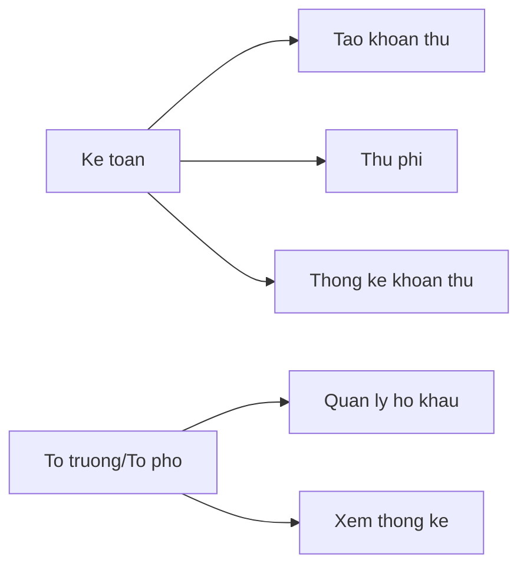
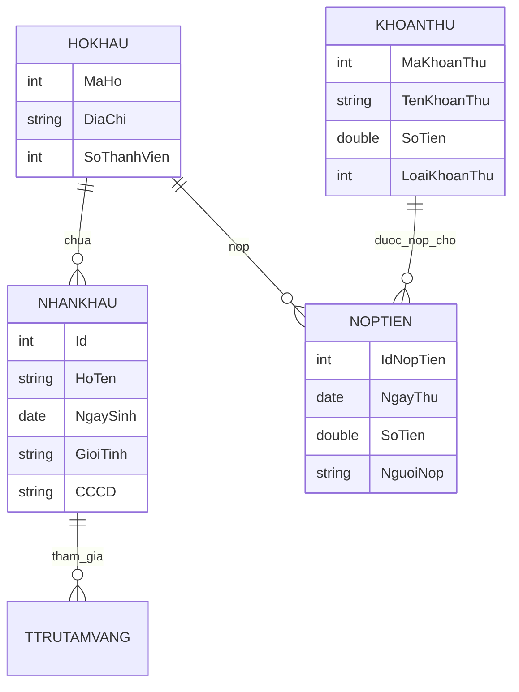

## Báo cáo tổng hợp dự án phần mềm quản lý thu phí chung cư BlueMoon

> Tài liệu này tổng hợp và trả lời các yêu cầu chính trong **“Nhập môn Công nghệ phần mềm – Bộ bài tập (08. Bo Bai Tap.pdf)”** cho bài toán chung cư BlueMoon, dựa trên hệ thống UI/UX và mã nguồn hiện có trong project React hiện tại.

---

### Mục lục ngắn

- Chương 2 – Vòng đời phần mềm (Tuyên ngôn dự án, quy trình, kế hoạch)
- Chương 3 – Agile & Scrum (Product Backlog, Sprint Backlog, bảng công việc)
- Chương 4 – Quản lý dự án (WBS, kế hoạch, rủi ro)
- Chương 5 – Quản lý cấu hình (cấu trúc thư mục, Git/GitHub)
- Chương 6 – Kỹ nghệ yêu cầu (tác nhân, use case, đặc tả chi tiết)
- Chương 7 – Thiết kế phần mềm (kiến trúc MVC, dữ liệu, giao diện)
- Chương 8 – Xây dựng phần mềm (mã nguồn, convention, refactor đơn giản)
- Chương 9 – Đảm bảo chất lượng (test case, chiến lược kiểm thử)

---

## Chương 2 – Vòng đời phần mềm

### 2.1 Tuyên ngôn dự án (Project Charter)

**Tên dự án:**  
Xây dựng phần mềm quản lý và thu phí ở chung cư BlueMoon.

**Nhà tài trợ dự án / Cơ quan tài trợ:**  
Ban quản trị chung cư BlueMoon phối hợp Công ty phần mềm ABC.

**Bối cảnh và động cơ**

- Chung cư BlueMoon (ngã tư Văn Phú, Hà Đông, Hà Nội) có 30 tầng (1 tầng kiot, 4 tầng đế, 24 tầng ở, 1 tầng penthouse), diện tích xây dựng 450m².
- Hiện việc thu phí được thực hiện thủ công, một phần qua Excel, khó kiểm soát, khó thống kê, dễ sai sót.
- Ban quản trị cần một phần mềm tập trung để:
  - Quản lý **các khoản thu bắt buộc**: phí dịch vụ chung cư, phí quản lý, phí gửi xe, phí vệ sinh,...
  - Quản lý **các khoản đóng góp tự nguyện**: quỹ vì người nghèo, quỹ biển đảo, quỹ từ thiện,...
  - Quản lý **thông tin hộ khẩu / nhân khẩu** để hỗ trợ cho chính quyền địa phương.

**Mục đích & mục tiêu đo được**

- Quản lý được **100%** các loại phí cần thu.
- Quản lý được **100%** hộ gia đình và các biến động nhân khẩu liên quan.
- Hỗ trợ kế toán thống kê nhanh:
  - Tình trạng nộp phí theo từng khoản thu.
  - Các khoản còn nợ, tỷ lệ hoàn thành.

**Sản phẩm bàn giao**

- Cho khách hàng (Ban quản trị):
  - Bộ cài / hướng dẫn chạy web app (hiện tại là ứng dụng React chạy trên trình duyệt).
  - Tài liệu hướng dẫn sử dụng.
- Cho chủ đầu tư:
  - Mã nguồn React + tài liệu kỹ thuật:
    - Báo cáo này (`docs/BlueMoon-Report.md`) – tương ứng nhiều phần SRS, thiết kế, test.
    - Cấu trúc mã nguồn, sơ đồ kiến trúc, sơ đồ dữ liệu.

**Phạm vi**

- Bao gồm: đặc tả yêu cầu, phân tích, thiết kế, lập trình, kiểm thử và triển khai bản demo.
- Không bao gồm: nhập dữ liệu thật toàn bộ hộ khẩu/nhân khẩu của chung cư.

**Ngân sách & lịch trình (mô phỏng cho bài tập)**

- Ngân sách ước lượng: 100.000.000đ (như trong ví dụ tài liệu).
- Thời gian: Quý IV/2023 (trong bài tập), với các mốc:
  - Bàn giao phiên bản thử nghiệm: 30/11/2023.
  - Bàn giao phiên bản chính thức: 15/12/2023.

---

### 2.2 Tài liệu SRS rút gọn cho phần mềm (tóm lược)

**Chức năng chính**

- Đăng nhập hệ thống theo vai trò (Kế toán, Tổ trưởng/Tổ phó).
- Quản lý khoản thu:
  - Tạo, xem chi tiết các khoản thu (bắt buộc / đóng góp).
  - Theo dõi tỷ lệ thu, số hộ đã nộp / tổng số hộ.
- Thu phí:
  - Chọn khoản thu.
  - Chọn hộ gia đình.
  - Ghi nhận thông tin nộp tiền (người nộp, số tiền, ngày nộp).
- Thống kê:
  - Thống kê trạng thái thu phí theo từng khoản, từng hộ (đã nộp / chưa nộp).
  - Xuất báo cáo (mock) và in báo cáo (mock).
- Quản lý cư dân:
  - Danh sách hộ khẩu, thông tin chủ hộ, địa chỉ căn hộ.
  - Chi tiết nhân khẩu trong mỗi hộ (thành viên, quan hệ, CCCD,...).
- Quản lý căn hộ:
  - Sơ đồ tầng, block, trạng thái căn hộ (đang ở, trống, bảo trì).
  - Tình trạng thu phí theo căn hộ (đã nộp / chưa nộp).
- Quản lý người dùng & cài đặt:
  - Hồ sơ cá nhân, đổi mật khẩu (mock).
  - Thông tin chung cư (tên, địa chỉ, số tầng, số căn,...).

**Yêu cầu phi chức năng (chính)**

- Giao diện tiếng Việt, thân thiện với kế toán và tổ trưởng khu dân cư.
- Hệ thống chạy trên web browser hiện đại (Chrome/Edge).
- Dữ liệu demo hiện tại nằm ở client; trong triển khai thực tế sẽ kết nối MySQL.

---

### 2.3 Đề xuất quy trình phát triển

- Áp dụng mô hình **Agile – Scrum** đơn giản:
  - Sprint 1: Xây dựng luồng quản lý khoản thu.
  - Sprint 2: Thu phí và thống kê.
  - Sprint 3: Quản lý cư dân và căn hộ, hoàn thiện UI/UX.
- Mỗi Sprint ~2 tuần, có Sprint Planning, Daily Standup, Sprint Review & Retrospective.

**Vai trò**

- Product Owner: Đại diện Ban quản trị (ví dụ: Trưởng ban quản trị chung cư).
- Scrum Master: Đại diện công ty phần mềm.
- Development Team:
  - 1 Tech Lead / Architect.
  - 2–3 Frontend Dev (React).
  - 1–2 Backend Dev (Java + MySQL) – trong bài tập hiện tại mock ở phía client.

---

## Chương 3 – Agile & Scrum (Backlog, Sprint, Bảng công việc)

### 3.1 Product Backlog (ví dụ)

| Độ ưu tiên | Hạng mục                                                                                                           | Ước tính (ngày công) |
|-----------:|--------------------------------------------------------------------------------------------------------------------|----------------------:|
| 1          | Là kế toán, tôi muốn **tạo khoản thu** mới để hệ thống ghi nhận tất cả hộ phải nộp khoản thu này                  | 3                    |
| 2          | Là kế toán, tôi muốn **ghi nhận các khoản thu** của từng hộ                                                       | 4                    |
| 3          | Là kế toán, tôi muốn **thống kê các khoản đóng góp** và xuất báo cáo                                              | 4                    |
| 4          | Là tổ trưởng, tôi muốn **xem thông tin hộ khẩu / nhân khẩu** theo từng căn hộ                                   | 3                    |
| 5          | Là quản trị viên, tôi muốn **quản lý tài khoản người dùng, vai trò và phân quyền**                               | 5                    |
| 6          | Là kế toán, tôi muốn **xem sơ đồ tầng / trạng thái căn hộ** để dễ tìm kiếm hộ liên quan                           | 3                    |

> Trong project hiện tại, UI/UX cho 1–4 và 6 đã được cài đặt dạng prototype, còn 5 ở mức giao diện cấu hình đơn giản.

### 3.2 Sprint Backlog (ví dụ cho Sprint 1 – Quản lý khoản thu)

| Product Backlog   | Sprint Task (việc chi tiết)                                            | Người thực hiện | Ước tính (ngày) |
|-------------------|-------------------------------------------------------------------------|------------------|-----------------:|
| Tạo khoản thu     | Thiết kế giao diện popup “Tạo khoản thu” trên Figma                    | Dev FE 1         | 1                |
|                   | Cài đặt component `CreateFeeDialog` (React) với validate cơ bản        | Dev FE 1         | 1.5              |
|                   | Kết nối với state toàn cục trong `App` (thêm FeeItem mới)              | Dev FE 2         | 1                |
|                   | Cập nhật Dashboard & FeeScreen hiển thị dữ liệu mới                    | Dev FE 2         | 0.5              |

### 3.3 Bảng công việc trên GitHub Project (hướng dẫn)

- Tạo repository trên GitHub: `bluemoon-fee-management`.
- Tạo **Project** theo template Scrum:
  - Cột: Product Backlog, Sprint Backlog, Todo, In Progress, Review, Done.
- Mỗi hạng mục ở Product Backlog được tạo thành issue, liên kết với task trong Sprint Backlog.

---

## Chương 4 – Quản lý dự án

### 4.1 WBS theo sản phẩm bàn giao (trích yếu)

1. **Phần mềm quản lý & thu phí BlueMoon**
   1.1. Module Quản lý thu phí  
   1.2. Module Quản lý người dùng  
   1.3. Module Quản lý hộ gia đình  
   1.4. Module Thống kê & Báo cáo

Mỗi module tiếp tục phân rã thành các chức năng chi tiết (Tạo khoản thu, Thu phí, Thống kê theo khoản, …).

### 4.2 WBS theo quy trình (Waterfall/Agile)

- 1. Quản lý dự án
  - 1.1. Lập kế hoạch
  - 1.2. Giám sát & kiểm soát
  - 1.3. Kết thúc dự án
- 2. Xây dựng phần mềm
  - 2.1. Kỹ nghệ yêu cầu
  - 2.2. Phân tích & thiết kế
  - 2.3. Cài đặt (coding)
  - 2.4. Kiểm thử
- 3. Vận hành & hỗ trợ

### 4.3 Quản lý rủi ro (rút gọn, bám theo Bảng 4–1…4–3)

Ví dụ **rủi ro**:

- Nhân sự rời khỏi dự án giữa chừng.
- Khách hàng thay đổi yêu cầu sau khi đã thống nhất.
- Thiếu tài liệu kỹ thuật đầy đủ.
- Giao tiếp giữa các bên không hiệu quả.

Mỗi rủi ro được đánh giá **xác suất (thấp/vừa/cao)** và **tác động (thấp/vừa/cao)**, từ đó xếp vào ma trận 1–5 (trivial → nghiêm trọng).

---

## Chương 5 – Quản lý cấu hình

### 5.1 Cấu trúc thư mục dự án (trong project hiện tại)

```text
project-root/
  src/
    app/
      App.tsx
      components/
        LoginScreen.tsx
        Sidebar.tsx
        DashboardScreen.tsx
        FeeScreen.tsx
        CreateFeeDialog.tsx
        CollectPaymentDialog.tsx
        ResidentScreen.tsx
        ApartmentScreen.tsx
        StatisticsScreen.tsx
        SettingsScreen.tsx
        figma/ImageWithFallback.tsx
      types.ts
    styles/
      index.css
      tailwind.css
      theme.css
      fonts.css
    main.tsx
  docs/
    BlueMoon-Report.md   ← tài liệu hiện tại
  index.html
  package.json
  vite.config.ts
```

### 5.2 Quy ước đặt tên

- Component React: PascalCase, ví dụ `LoginScreen`, `CreateFeeDialog`.
- Biến và hàm: camelCase, ví dụ `handleLogin`, `selectedHousehold`.
- Kiểu/Interface TypeScript: PascalCase, ví dụ `FeeItem`.

### 5.3 Sử dụng Git/GitHub (hướng dẫn)

- Khởi tạo Git trong thư mục:  
  `git init`
- Tạo remote GitHub, kết nối:  
  `git remote add origin https://github.com/<user>/bluemoon-fee-management.git`
- Luồng làm việc:
  - `git checkout -b feature/fee-management`
  - Code, commit nhỏ, có ý nghĩa.
  - `git push -u origin feature/fee-management`
  - Tạo Pull Request lên `main`.

---

## Chương 6 – Kỹ nghệ yêu cầu

### 6.1 Tác nhân chính

- **Kế toán** – sử dụng hệ thống để:
  - Tạo khoản thu.
  - Thu phí.
  - Thống kê báo cáo.
- **Tổ trưởng/Tổ phó** – sử dụng hệ thống để:
  - Quản lý hộ khẩu, nhân khẩu.
  - Xem báo cáo liên quan khu vực mình phụ trách.

### 6.2 Use Case tổng quan (mô tả bằng mermaid)



### 6.3 Đặc tả chi tiết Use Case “Tạo khoản thu”

- **Mã UC:** UC002  
- **Tên:** Tạo khoản thu  
- **Tác nhân chính:** Kế toán  
- **Tiền điều kiện:** Kế toán đã đăng nhập hệ thống.

**Luồng sự kiện chính**

1. Kế toán chọn chức năng **“Tạo khoản thu”** trên Dashboard hoặc màn Khoản thu.
2. Hệ thống hiển thị popup `Tạo khoản thu mới`.
3. Kế toán chọn **Loại khoản thu**: Bắt buộc / Đóng góp.
4. Kế toán nhập **Tên khoản thu**.
5. Kế toán nhập **Số tiền** (và đơn vị ngầm định).
6. Kế toán chọn **Thời hạn**.
7. Kế toán nhập **Ghi chú** (nếu có).
8. Kế toán nhấn nút **“Tạo khoản thu”**.
9. Hệ thống kiểm tra dữ liệu, nếu hợp lệ:
   - Lưu khoản thu mới vào danh sách `fees` (state trong `App.tsx`).
   - Hiển thị toast “Tạo khoản thu thành công”.
   - Cập nhật Dashboard & FeeScreen.

**Luồng thay thế (dữ liệu thiếu / không hợp lệ)**

- 6a. Nếu bỏ trống các trường bắt buộc (Tên, Số tiền với khoản bắt buộc, Thời hạn):
  - Hệ thống hiển thị thông báo lỗi đỏ dưới từng trường.
  - Không tạo khoản thu, popup vẫn mở.

---

## Chương 7 – Thiết kế phần mềm

### 7.1 Kiến trúc tổng thể – MVC trên frontend

Trong phiên bản React hiện tại, kiến trúc ở mức **MVC đơn giản phía client**:

- **Model (M)** – cấu trúc dữ liệu:
  - `FeeItem` trong `src/app/types.ts`.
  - Các mảng dữ liệu demo cho hộ khẩu, căn hộ, thống kê.
- **View (V)** – các component React:
  - `LoginScreen`, `DashboardScreen`, `FeeScreen`, `ResidentScreen`, `ApartmentScreen`, ...
- **Controller (C)** – logic điều khiển & state:
  - `App.tsx` – quản lý đăng nhập, trang hiện tại, danh sách `fees`, mở/đóng dialog,...
  - Các handler trong từng screen (ví dụ `handleLogin`, `handleAddFee`, `onCollectPayment`).

### 7.2 Mô hình dữ liệu (ERD rút gọn)



### 7.3 Thiết kế màn hình (đã hiện thực trong code)

- **Login**: Split layout, bên trái hình minh hoạ chung cư; bên phải form đăng nhập + chọn vai trò.
- **Trang chủ (Dashboard)**:
  - Card tổng quan (Tổng căn hộ, Tổng cư dân, Khoản thu, Tỉ lệ thu).
  - Biểu đồ cột lịch sử thu phí.
  - Bảng “Khoản thu gần đây”.
  - Ô “Thao tác nhanh”: Tạo khoản thu, Thu phí, Xuất báo cáo.
- **Khoản thu**:
  - Lưới card hiển thị mỗi khoản thu, badge “Bắt buộc”/“Đóng góp”, tiến độ, ghi chú.
  - Màn chi tiết khoản thu với bảng hộ đã nộp / chưa nộp.
- **Thu phí**:
  - Form ba phần (Thông tin khoản thu, Thông tin hộ gia đình, Thông tin nộp tiền).
- **Cư dân / Hộ khẩu**:
  - Bảng hộ khẩu bên trái, panel chi tiết bên phải với tabs: Nhân khẩu, Tạm trú/Tạm vắng, Lịch sử.
- **Căn hộ**:
  - Selector tầng bên trái, lưới căn hộ theo block, panel chi tiết từng căn (trạng thái, chủ hộ, tình trạng thu phí).

---

## Chương 8 – Xây dựng phần mềm

### 8.1 Mã nguồn & convention

Project tuân theo một số nguyên tắc từ chương 8:

- Cách lề 2 spaces (ESLint/Prettier có thể bổ sung nếu cần).
- Tên lớp/kiểu: PascalCase (`FeeItem`, `LoginScreen`).
- Tên biến/hàm: camelCase (`selectedFee`, `handleAddFee`).
- Hạn chế logic trong View; phần lớn state nằm ở `App.tsx` và các screen lớn.

### 8.2 Refactor & tránh “code smell”

- Dữ liệu `FeeItem` được tách sang `src/app/types.ts` và state `fees` ở cấp `App.tsx`, tránh duplicating data ở nhiều nơi (giảm **Data Clump**).
- `DashboardScreen` và `FeeScreen` đều dùng chung dữ liệu `fees` từ `App`, tránh double source of truth.

---

## Chương 9 – Đảm bảo chất lượng phần mềm

### 9.1 Các luồng nghiệp vụ chính cần kiểm thử

1. Đăng nhập.
2. Tạo khoản thu.
3. Thu phí cho một hộ.
4. Xem thống kê khoản thu.

### 9.2 Ví dụ test case (hộp đen)

**TC01 – Đăng nhập thành công**

- Bước:
  1. Mở trang Login.
  2. Chọn vai trò “Kế toán”.
  3. Nhập email hợp lệ `kt@bluemoon.vn`.
  4. Nhập mật khẩu `123456`.
  5. Nhấn “Đăng nhập”.
- Kỳ vọng:
  - Không hiển thị lỗi validate.
  - Hiện toast “Đăng nhập thành công”.
  - Chuyển sang Dashboard.

**TC02 – Đăng nhập thiếu email**

- Bước:
  1. Bỏ trống email.
  2. Nhập mật khẩu “123456”.
  3. Nhấn “Đăng nhập”.
- Kỳ vọng:
  - Hiển thị lỗi đỏ dưới ô Email “Vui lòng nhập email”.
  - Không chuyển trang.

**TC03 – Tạo khoản thu bắt buộc hợp lệ**

- Bước:
  1. Từ Dashboard, bấm “Tạo khoản thu”.
  2. Chọn loại “Bắt buộc”.
  3. Nhập tên “Phí gửi xe T4/2026”.
  4. Nhập số tiền `200000`.
  5. Chọn hạn nộp “2026-04-30”.
  6. Nhấn “Tạo khoản thu”.
- Kỳ vọng:
  - Không có lỗi validate.
  - Toast “Tạo khoản thu thành công”.
  - Trong màn “Khoản thu” xuất hiện card mới ở đầu danh sách.

**TC04 – Tạo khoản thu thiếu số tiền (bắt buộc)**

- Bước:
  1. Chọn loại “Bắt buộc”.
  2. Để trống ô “Số tiền”.
  3. Nhấn “Tạo khoản thu”.
- Kỳ vọng:
  - Hiển thị lỗi đỏ “Vui lòng nhập số tiền hợp lệ”.
  - Không tạo khoản thu mới.

**TC05 – Thu phí cho hộ gia đình**

- Bước:
  1. Từ Dashboard, bấm “Thu phí”.
  2. Chọn một “Khoản thu” đang thu.
  3. Chọn một hộ gia đình trong danh sách.
  4. Nhập “Người nộp” là tên bất kỳ.
  5. Nhập “Số tiền nộp” > 0.
  6. Nhấn “Xác nhận thu phí”.
- Kỳ vọng:
  - Nếu thiếu thông tin, toast lỗi “Vui lòng nhập đủ thông tin”.
  - Nếu đủ, toast thành công “Thu phí thành công”.

---

## Kết luận

Tài liệu này:

- Đã **bám sát nội dung các chương 2–9** trong “Bộ bài tập Nhập môn Công nghệ phần mềm” cho bài toán chung cư BlueMoon, ở mức phù hợp với 1 project demo.
- Gắn chặt với **mã nguồn React hiện có**, mô tả:
  - Tuyên ngôn dự án, phạm vi, quy trình.
  - Backlog, WBS, rủi ro, quản lý cấu hình.
  - Yêu cầu, use case, thiết kế dữ liệu & giao diện.
  - Cấu trúc mã nguồn, nguyên tắc code cơ bản.
  - Một số test case chính cho các luồng nghiệp vụ.

Bạn có thể nộp tài liệu này kèm theo project mã nguồn như một bản **báo cáo tổng hợp** cho bài tập chung cư BlueMoon. Nếu giảng viên yêu cầu thêm chi tiết ở chương nào, có thể tách ra thành `docs/ChapterX-...md` từ nội dung ở đây.

