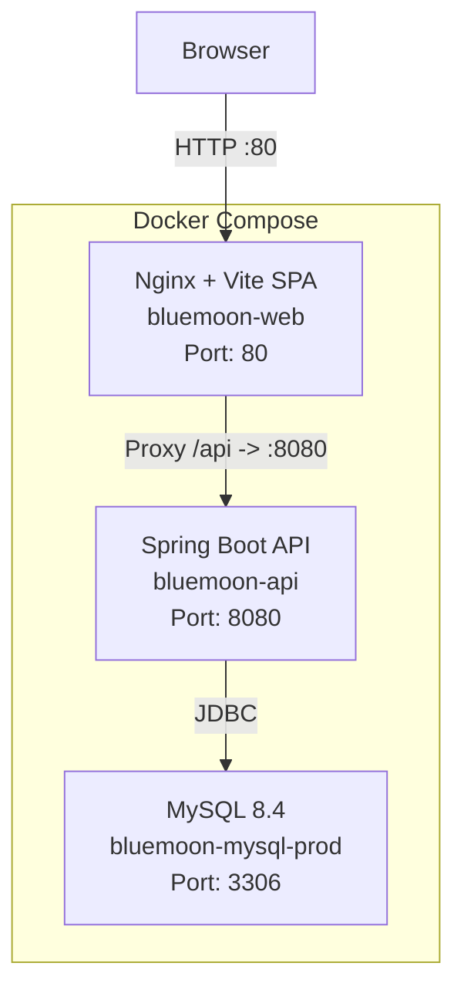
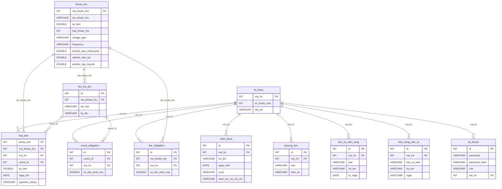
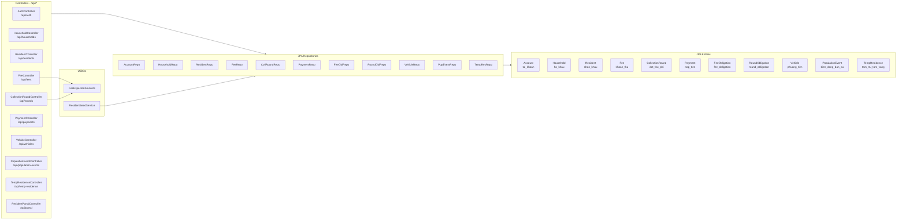
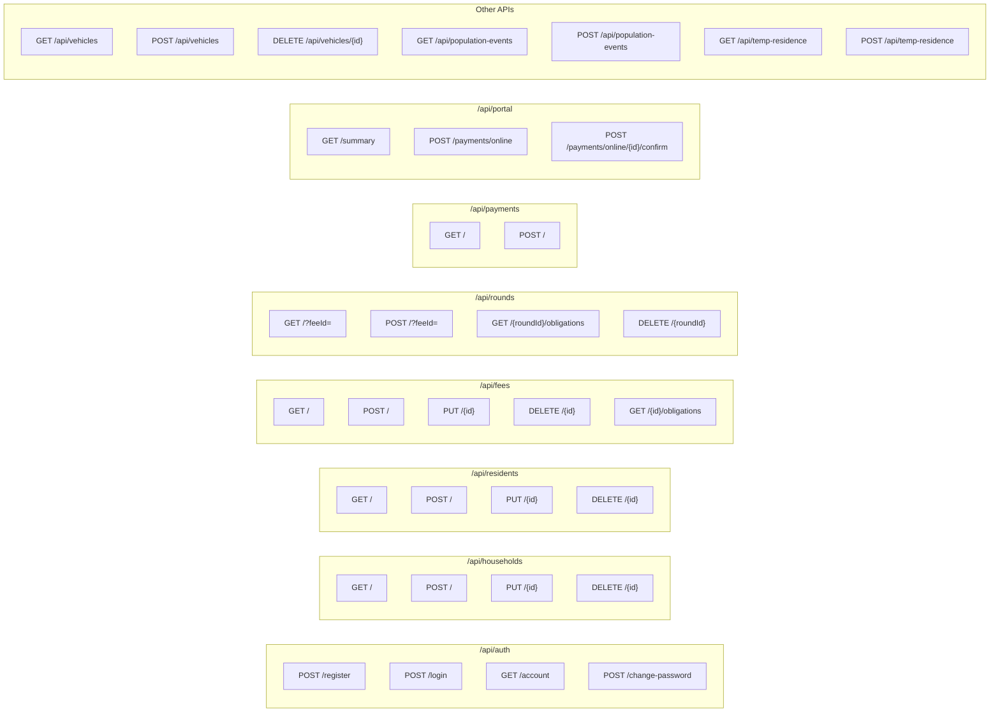
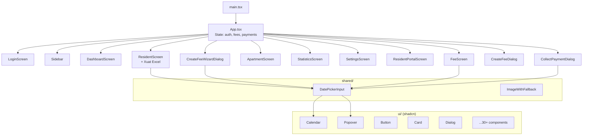
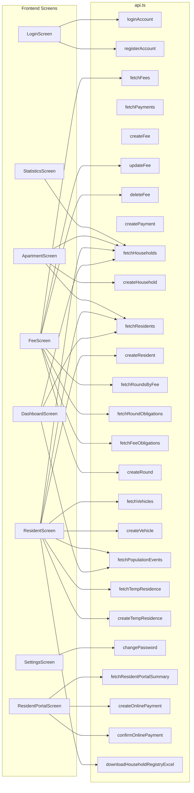
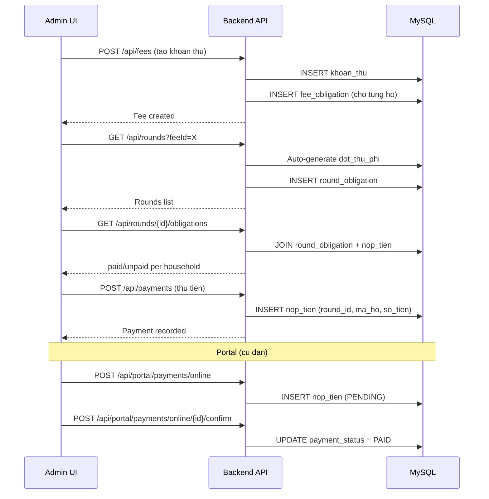

# Diagram Kiến Trúc Toàn Bộ Source BlueMoon

Tài liệu mô tả kiến trúc source code BlueMoon: Infrastructure, Backend (Spring Boot), Frontend (React/Vite), Database (MySQL), và luồng dữ liệu giữa các tầng.

---

## 1. Tổng quan hệ thống (Infrastructure)

---

## 2. Database Schema (MySQL `bluemoon`)

---

## 3. Backend (Spring Boot)

### 3a. Kiến trúc tầng

### 3b. Controller → Endpoint chi tiết

---

## 4. Frontend (React + Vite + TypeScript)

### 4a. Component Tree

### 4b. Data Flow: Screen → API → Backend

*Ghi chú thực tế mã nguồn:* `downloadHouseholdRegistryExcel` được định nghĩa trong `app/utils/exportHouseholdExcel.ts` và `ResidentScreen` gọi trực tiếp; không nằm trong `api.ts` (diagram trên giữ cùng nhóm với luồng màn hình theo plan).

### 4c. Luồng thanh toán (Fee Collection Flow)

---

## 5. File listing

### Backend Java (`backend/src/main/java/vn/bluemoon/backend/`)

- **config/**: `CorsConfig.java`, `DemoResidentDataLoader.java`
- **controller/**: `AuthController`, `HouseholdController`, `ResidentController`, `FeeController`, `CollectionRoundController`, `PaymentController`, `VehicleController`, `PopulationEventController`, `TempResidenceController`, `ResidentPortalController`
- **model/**: `Account`, `Household`, `Resident`, `Fee`, `CollectionRound`, `Payment`, `FeeObligation`, `RoundObligation`, `Vehicle`, `PopulationEvent`, `TempResidence`
- **repository/**: một repo cho mỗi entity (11 class)
- **service/**: `ResidentSeedService` (seed data)
- **util/**: `FeeExpectedAmounts` (tính nghĩa vụ theo loại xe)
- **exception/**: `GlobalExceptionHandler`

### Frontend (`src/`)

- **`main.tsx`**: entry point
- **`app/App.tsx`**: root component, auth state, fee/payment state, routing
- **`app/api.ts`**: các hàm gọi REST, cache trong bộ nhớ
- **`app/types.ts`**: `FeeItem`, `Payment`, `Household`, `Resident`, `UserRole`, …
- **`app/utils/exportHouseholdExcel.ts`**: xuất Excel (exceljs)
- **`app/components/`**: các màn hình + dialog (Login, Dashboard, Fee, Resident, v.v.)
- **`app/components/shared/`**: `DatePickerInput`, `ImageWithFallback`
- **`app/components/ui/`**: ~35 primitive shadcn/ui (Calendar, Popover, Button, Card, …)
- **`styles/`**: `theme.css`, `fonts.css`, `tailwind.css`, `index.css`

### Config / Infra

- `docker-compose.yml`: MySQL + API + Web (3 services)
- `vite.config.ts`: Vite + React plugin
- `backend/pom.xml`: Spring Boot + MySQL + JPA
- `backend/sql/schema.sql`: các bảng chính
- `.env` / `.env.example`: mật khẩu, URL API
